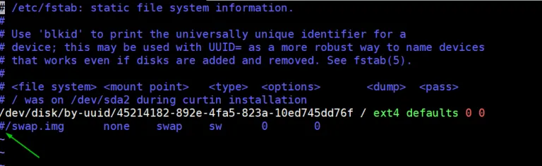

# Managing Kubernetes on Ubuntu 20.04 Server
Kubernetes (k8s) is a free and open-source container orchestration tool. It is used for deploying, scaling and managing containerized based applications. In this article we will demonstrate how to install a Kubernetes cluster using **kubeadm**. Before you begin ensure you have the following:
- One or more machines running a deb/rpm-compatible Linux OS; for example: Ubuntu or CentOS.
- 2 GiB or more of RAM per machine--any less leaves little room for your apps.
- At least 2 CPUs on the machine that you use as a control-plane node.
- Full network connectivity among all machines in the cluster. You can use either a public or a private network.
- Privileged user with sudo rights

## Lab Setup
The foloowing are the details of my lab setup:

- Machine 1 (Ubuntu 20.04 LTS Server) – kubemaster.com – 192.168.1.4

- Machine 2 (Ubuntu 20.04 LTS Server) – kubeworkernode1.com – 192.168.1.5

- Machine 3 (Ubuntu 20.04 LTS Server) – kubeworkernode2.com – 192.168.1.6


## Step 1 - Set the hostname and add entries on the /etc/hosts file
On each of the machine set the hostname on each node.

master node:
```bash
sudo hostnamectl set-hostname "kubemaster.com"
```

worker node 1:
```bash
sudo hostnamectl set-hostname "kubeworkernode1.com"
```

worker node 2:
```bash
sudo hostnamectl set-hostname "kubeworkernode2.com"
```

After the above commands, add the following entries in the /etc/hosts files on each node,

    192.168.1.4 kubemaster.com
    192.168.1.5 kubeworkernode1.com
    192.168.1.6 kubeworkernode2.com

## Step 2 Install a Container runtime on all 3 nodes
For this set up we will install docker.

### Uninstall old version of docker.
```bash
sudo apt-get remove docker docker-engine docker.io containerd runc
```
It’s OK if apt-get reports that none of these packages are installed. The contents of /var/lib/docker/, including images, containers, volumes, and networks, are preserved.


### Set up the repository
- Update the apt package index and install packages to allow apt to use a repository over HTTPS:
```bash
sudo apt-get update
```

```bash
sudo apt-get install \
    apt-transport-https \
    ca-certificates \
    curl \
    gnupg \
    lsb-release
```
- Add Docker’s official GPG key:
```bash
curl -fsSL https://download.docker.com/linux/ubuntu/gpg | sudo gpg --dearmor -o /usr/share/keyrings/docker-archive-keyring.gpg
```
- Use the following command to set up the stable repository. To add the nightly or test repository, add the word nightly or test (or both) after the word stable in the commands below.
```bash
echo \
  "deb [arch=amd64 signed-by=/usr/share/keyrings/docker-archive-keyring.gpg] https://download.docker.com/linux/ubuntu \
  $(lsb_release -cs) stable" | sudo tee /etc/apt/sources.list.d/docker.list > /dev/null
```

### Install Docker Engine
- Update the apt package index, and install the latest version of Docker Engine and containerd, or go to the next step to install a specific version:
```bash
sudo apt-get update
```
```bash
sudo apt-get install docker-ce docker-ce-cli containerd.io
```
- To install a specific version of Docker Engine, list the available versions in the repo, then select and install:
    - List the versions available in your repo:
```bash
apt-cache madison docker-ce
```
Install a specific version using the version string from the second column
```bash
sudo apt-get install docker-ce=<VERSION_STRING> docker-ce-cli=<VERSION_STRING> containerd.io
```
Now start and enable docker service on each node using beneath systemctl command
```bash
sudo systemctl enable docker.service --now
```
Run the following command to verify the status of docker service and its version,
```bash
systemctl status docker
```
```bash
docker --version
```

## Step 3 Disable swap and enable IP forwarding on all nodes
To disable swap, edit /etc/fstab file and comment out the line which includes entry either swap partition or swap file.
```bash
sudo vi /etc/fstab
```


Save & exit the file

Run swapoff command to disable the swap on the fly

```bash
sudo swapoff -a
```

To enable the ip forwarding permanently, edit the file “/etc/sysctl.conf” and look for line “net.ipv4.ip_forward=1” and un-comment it. After making the changes in the file, execute the following command

```bash
sudo sysctl -p
```

## Step 4 -Install Kubectl, kubelet and kubeadm on all nodes
- Update the apt package index and install packages needed to use the Kubernetes apt repository
```bash
sudo apt-get update
```
```bash
sudo apt-get install -y apt-transport-https ca-certificates curl
```
- Download the Google Cloud public signing key:
```bash
sudo curl -fsSLo /usr/share/keyrings/kubernetes-archive-keyring.gpg https://packages.cloud.google.com/apt/doc/apt-key.gpg
```
- Add the Kubernetes apt repository:
```bash
echo "deb [signed-by=/usr/share/keyrings/kubernetes-archive-keyring.gpg] https://apt.kubernetes.io/ kubernetes-xenial main" | sudo tee /etc/apt/sources.list.d/kubernetes.list
```
- Update apt package index, install kubelet, kubeadm and kubectl, and pin their version:
```bash
sudo apt-get update
```

```bash
sudo apt-get install -y kubelet kubeadm kubectl
```

## Step 5 - Initialize Kubernetes Cluster using kubeadm (from master node)
Login to your master node kubemaster.com and run below ‘kubeadm init‘ command to initialize Kubernetes cluster,
```bash
sudo kubeadm init --control-plane-endpoint=kubemaster.com
```
Once the cluster is initialized successfully, follow the instruction on the output

Now Join the worker nodes kubeworkernode1.com and kubeworkernode2.com to cluster, command to join the cluster is already there in the output. Copy “kubeadm join” command and paste it on both nodes (worker nodes).

From the master node run “kubectl get nodes” command to verify nodes status.

As we can see both worker nodes and master node have joined the cluster, but status of each node is “NotReady”. To make the status “Ready” we must deploy Container Network Interface (CNI) based Pod network add-ons like calico, kube-router and weave-net. As the name suggests, pod network add-ons allow pods to communicate each other.

## Step 6 - Deploy Calico Pod Network Add-on (Master Node)
From the master node, run the following command to install Calico pod network add-on,

```bash
kubectl apply -f https://docs.projectcalico.org/v3.14/manifests/calico.yaml
```

Once it has been deployed successfully then nodes status will become ready, let’s re-run kubectl command to verify nodes status

Confirm and veryfy the status of pods from all namespaces
```bash
kubectl get pods --all-namespaces
```

Note: To enable bash completion feature on your master node, execute the followings

```bash
echo 'source <(kubectl completion bash)' >>~/.bashrc
```
```bash
source .bashrc
```