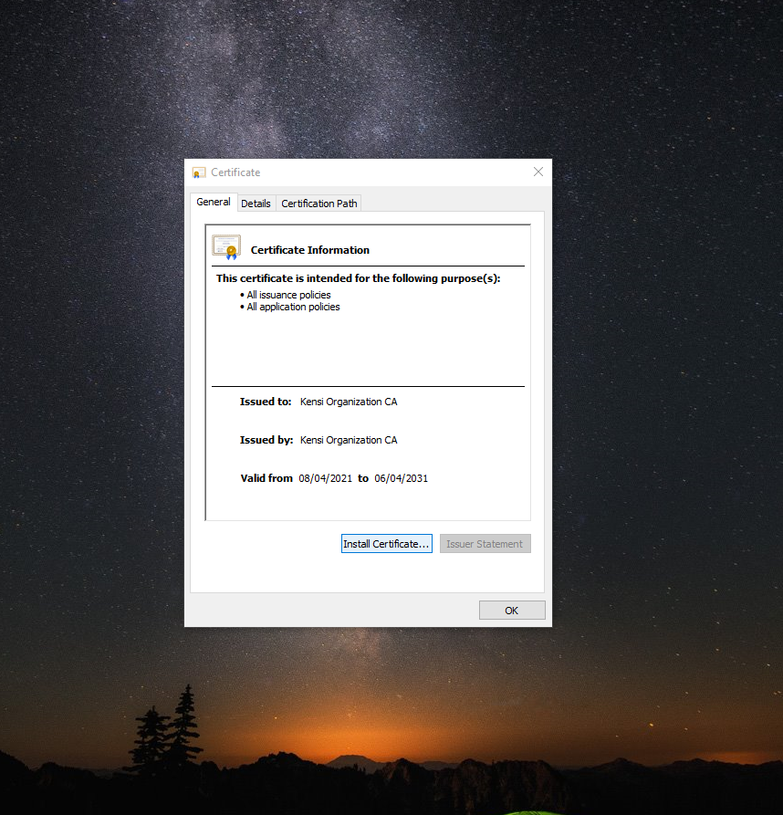
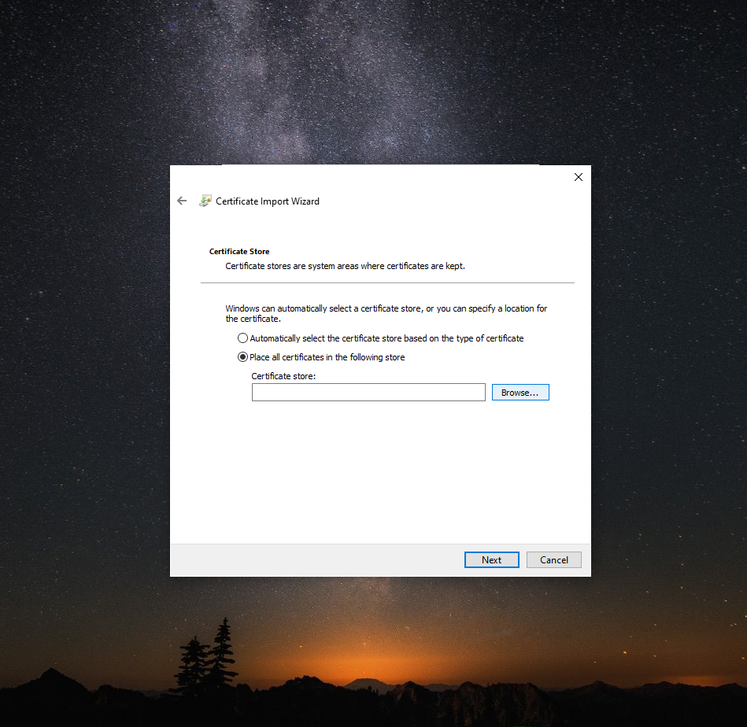
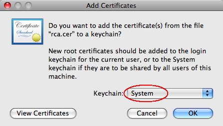
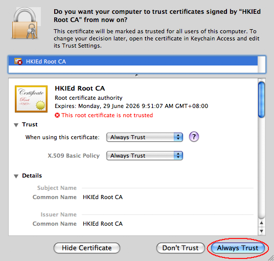
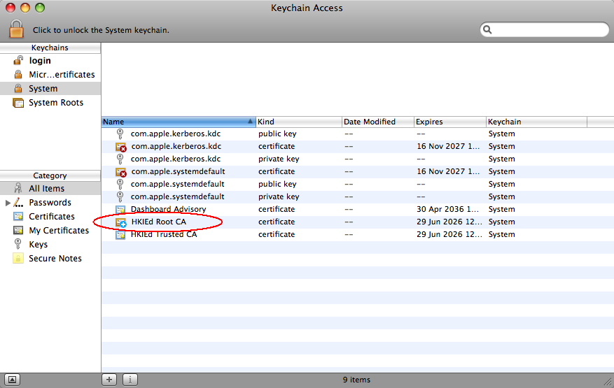

# Install Certificate Authority Certificate

## On Windows machine
### Step 1
Double click on the provided certificate which pops up the window below.

Click on install certificate.

### Step 2
Ensure the certificate will be stored on the current user account on the bellow wizard section


### Step 3
Manually define where the certficate will be stored by selecting "Place all certificates in the followinf store"

### Step 4
Select the browse button to define where the certificate will be stored

### Step 5
Ensure you select the "Trusted Root Certificate Authorities" store.

### Step 6
Once that is done click on the finish button and your certificate authorities' certificate will be installed.


## On Linux machine
Now that you have a copy of the ca.crt file on your second Linux system, it is time to import the certificate into its operating system certificate store.

On Debian and Ubuntu based systems, run the following commands to import the certificate:

```bash
    cp /tmp/ca.crt /usr/local/share/ca-certificates/
```

```bash
    update-ca-certificates
```

To import the CA Server’s certificate on CentOS, Fedora, or RedHat based system, copy and paste the file contents onto the system just like in the previous example in a file called /tmp/ca.crt. Next, you’ll copy the certificate into /etc/pki/ca-trust/source/anchors/, then run the update-ca-trust command.

```bash
    sudo cp /tmp/ca.crt /etc/pki/ca-trust/source/anchors/
```

```bash
    update-ca-trust
```
## On MacOS machine
Double click the certificate file. Choose "System" from the keychain option. Then press "OK".


When the following window pops-up, click the "Always Trust" button.


Then you will notice that the certificate is added to the system entry.


## On Andriod Phone
1. Your Android device will need to have a PIN set otherwise by default, you will not be able to install any certificates to the device. This can be found under Settings->Security->Screen Lock
2. Click on the SSL certificate file
3. On the "Name the certificate" screen gives the certificate a name and press the OK button.

To ensure that the installed certificate is Trusted, perform the following steps.
The exact location of the Trusted Credentials menu will depend on the version of Android the device is running.

1. Open the Settings App on the device.
2. Go to Security > Trusted Credentials, and tap the User tab
3. If the certificate is present in the list of User certificates, then the certificate installed correctly.