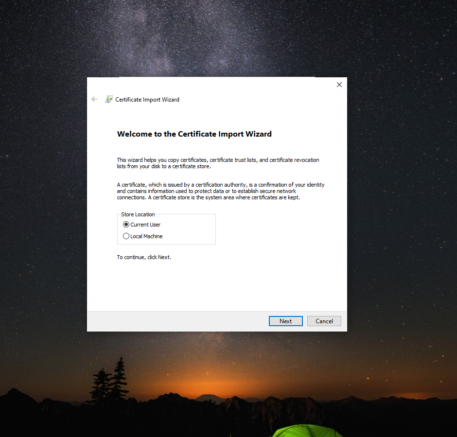

# Install Certificate Authority Certificate

## On Windows machine

### Step 1
Double click on the provided certificate which pops up the window below.

Click on install certificate.

### Step 2
Ensure the certificate will be stored on the current user account on the bellow wizard section

### Step 3
Manually define where the certficate will be stored by selecting "Place all certificates in the followinf store"

### Step 4
Select the browse button to define where the certificate will be stored

### Step 5
Ensure you select the "Trusted Root Certificate Authorities" store.

### Step 6
Once that is done click on the finish button and your certificate authorities' certificate will be installed.
